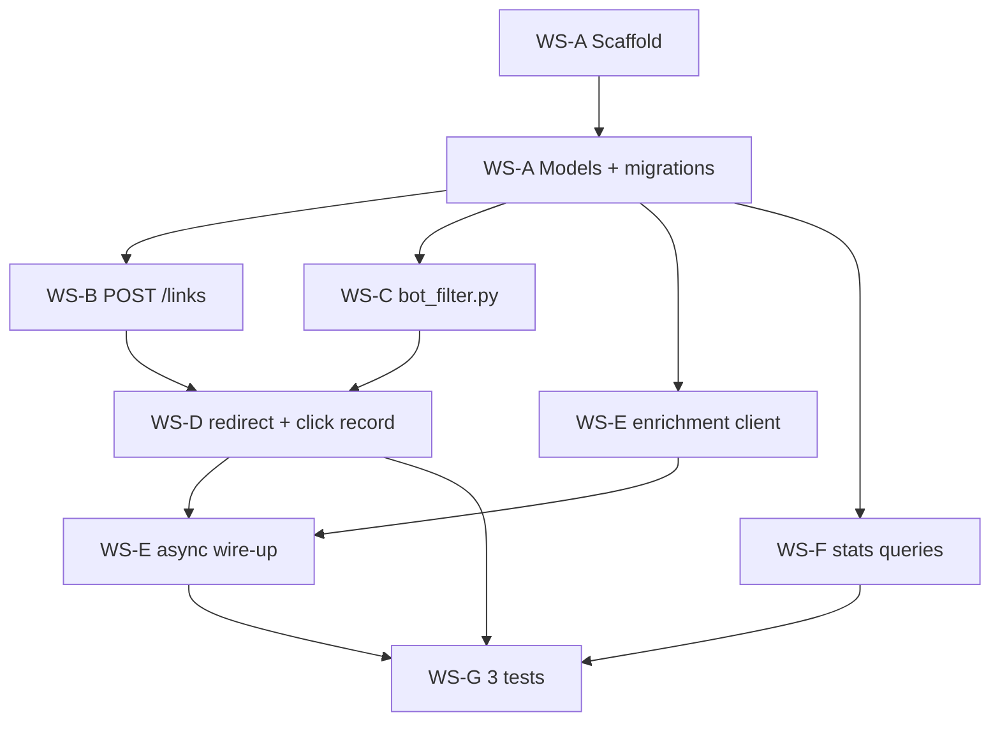

# TinyRouter — Implementation Plan

Compartmentalized plan for the Urban Legend take-home. Each section maps to a **small commit** and/or a **parallel agent workstream**. Goal: ~10 logical commits, agents can run concurrently where dependencies allow.

**Time cap:** 2 hours hard. Ship incomplete + honest README notes before polishing past the cap.

**README ground rule:** Agents write **code only**. You write README prose yourself (setup, curl examples, "How I used Cursor", "What I'd do next", time taken).

---

## Stack recommendation

| Choice | Recommendation | Why |
|--------|----------------|-----|
| Framework | **Django 5 + Django REST Framework** | Fast scaffold, clear module boundaries for parallel agents, built-in admin optional, `TestCase` for 3 tests |
| Database | **SQLite** | Zero setup for reviewers; swap to Postgres is trivial later |
| Async enrichment | **`threading` + fire-after-response** or **`django-background-tasks`** / raw `Thread` | Avoid Celery/Redis in a 2h take-home; document tradeoff in README |

If you prefer Rails, swap paths below (`app/models`, `app/controllers`, ActiveJob) — the workstreams and contracts stay the same.

---

## Requirement matrix (nothing missed)

| ID | Requirement | Owner workstream | Commit |
|----|-------------|------------------|--------|
| R1 | `POST /links` → slug + short_url | WS-B Links API | C5 |
| R2 | `GET /r/:slug` → 302 + UTM preserved | WS-D Redirect | C7 |
| R3 | Record `Click` on redirect (non-bot) | WS-D Redirect | C7 |
| R4 | ip-api.com enrichment (country, region, ASN/ISP) | WS-E Enrichment | C8–C9 |
| R5 | Enrichment non-blocking; nullable on failure | WS-E Enrichment | C9 |
| R6 | Bot filter (UA list + empty UA) | WS-C Bot filter | C6, integrated C7 |
| R7 | Bots still 302, no row | WS-D Redirect | C7 |
| R8 | `GET /links/:slug/stats` | WS-F Stats | C10 |
| R9 | Stats exclude bots | WS-F Stats | C10 |
| R10 | Exactly ~3 tests | WS-G Tests | C11 |
| R11 | README (human-written) | **You** | after code |
| S1 | IP dedup 5s window (stretch) | WS-H Stretch | C12a |
| S2 | Fraud score / hosting ASN (stretch) | WS-H Stretch | C12b |
| S3 | HTML stats page (stretch) | WS-H Stretch | C12c |

---

## Domain contracts (agents must not diverge)

Share these interfaces before parallel work starts (Wave 1 agent publishes this in code).

### Models

**`Link`**
- `destination_url` (URLField, max 2048)
- `campaign_code` (CharField)
- `creator_handle` (CharField)
- `slug` (CharField, unique, indexed) — generated, never changes

**`Click`**
- `link` → FK `Link` (or store `slug` denormalized; pick one, document in README)
- `slug` (CharField, indexed) — denormalized ok for stats queries
- `clicked_at` (DateTimeField, auto)
- `ip_address` (GenericIPAddressField, nullable)
- `user_agent` (TextField, blank=True)
- `query_params` (JSONField) — raw query string as dict
- `is_bot` (BooleanField, default=False) — **set at write time** so stats stay simple
- Enrichment (nullable): `country`, `region`, `isp` (or `asn` + `isp` per ip-api fields `as`, `isp`)
- Optional stretch: `fraud_score` (FloatField, null)

### Slug rules
- URL-safe: `[a-zA-Z0-9_-]{6,12}` or `SecureRandom.urlsafe_base64(8)` trimmed
- Unique constraint on DB
- `short_url` = `{BASE_URL}/r/{slug}` — `BASE_URL` from env `APP_BASE_URL` default `http://localhost:8000`

### Bot filter (pure function)

```python
# tinyrouter/bot_filter.py
BOT_SUBSTRINGS = [
    "facebookexternalhit", "twitterbot", "slackbot", "discordbot",
    "googlebot", "python-requests", "curl/", "wget/",
]

def is_bot(user_agent: str | None) -> bool:
    if not user_agent or not user_agent.strip():
        return True
    ua = user_agent.lower()
    return any(s in ua for s in BOT_SUBSTRINGS)
```

### IP enrichment (async)

```python
# tinyrouter/enrichment.py
def enrich_click_async(click_id: int) -> None: ...
# HTTP GET http://ip-api.com/json/{ip}?fields=status,country,regionName,isp,as
# On success: update Click row. On failure/timeout: leave nulls, log warning.
# Must NOT be called synchronously from redirect view.
```

### Stats response shape

```json
{
  "slug": "abc123",
  "total_clicks": 42,
  "unique_ips": 30,
  "by_country": { "US": 35, "CA": 7 }
}
```

- Filter: `is_bot=False`
- `unique_ips`: distinct `ip_address` where not null
- `by_country`: group by `country`, omit null country or bucket as `"unknown"`

---

## Dependency graph



**Serial gate:** Only **WS-A** blocks everything else. After **models land**, four agents can run in parallel (B, C, E-client, F-queries).

---

## Parallel workstreams (agent assignments)

Each workstream = one agent prompt. Give the agent: this file section + **only** the files it owns + domain contracts above.

### WS-A — Foundation (SERIAL, run first)

**Responsibility:** Project skeleton, settings, URL root, empty app `tinyrouter`.

**Files (exclusive):**
- `manage.py`, `config/` or project package, `tinyrouter/apps.py`
- `requirements.txt` (django, djangorestframework, requests)
- `.env.example` with `APP_BASE_URL`, `SECRET_KEY`
- `tinyrouter/models.py` — **Link + Click** definitions
- Initial migrations

**Commits:**
1. `chore: scaffold Django project and dependencies`
2. `feat: add Link and Click models with migrations`

**Done when:** `python manage.py migrate` succeeds; models match contracts.

**Handoff:** Push branch `feat/models` or merge to `main` before spawning B–F.

---

### WS-B — Create link API (PARALLEL after WS-A)

**Responsibility:** `POST /links` only.

**Files (exclusive):**
- `tinyrouter/views/links.py` (or `views.py` section)
- `tinyrouter/serializers.py` — `LinkCreateSerializer`
- `tinyrouter/services/slug.py` — `generate_unique_slug()`
- URL: `path("links", ...)` 

**Commit:** `feat: POST /links creates link and returns short_url`

**Acceptance:**
- Validates required JSON fields
- Returns `{ "slug", "short_url" }`
- 400 on invalid URL; 409 or retry on slug collision

**Does not touch:** redirect, enrichment, stats, bot_filter.

---

### WS-C — Bot filter (PARALLEL after WS-A)

**Responsibility:** Isolated, testable bot detection.

**Files (exclusive):**
- `tinyrouter/bot_filter.py`

**Commit:** `feat: add bot user-agent filter module`

**Acceptance:**
- `is_bot()` matches TASK.md list + empty UA
- Optional: 2–3 tiny unit tests in same file's test module **only if** they don't count toward the 3 integration tests (prefer zero extra tests)

**Does not touch:** views, models (except importing nothing).

---

### WS-D — Redirect + click recording (PARALLEL after WS-A; merge after B + C)

**Responsibility:** `GET /r/:slug` — 302, UTM merge, synchronous Click insert.

**Files (exclusive):**
- `tinyrouter/views/redirect.py`
- `tinyrouter/services/utm.py` — merge query params onto destination URL
- URL: `path("r/<slug>", ...)`

**Commit:** `feat: redirect endpoint records clicks and skips bots`

**Acceptance:**
- 302 to `destination_url` with incoming query params appended (UTM preserved)
- Creates `Click` with ip, ua, query_params, `is_bot=is_bot(ua)`
- If bot: **no** `Click` row (or row with `is_bot=True` and stats exclude — pick **no row** per spec "does not record")
- 404 unknown slug
- Calls `enrich_click_async(click.id)` **only if** click saved — stub ok until WS-E merges

**Depends on:** `Link` model, `is_bot`, slug from WS-B.

**Integration point:** import `enrich_click_async` from `tinyrouter.enrichment` (WS-E may add stub first).

---

### WS-E — IP enrichment (PARALLEL after WS-A; wire-up after WS-D)

Split into two commits for reviewability.

**Part 1 — HTTP client (parallel with B, C, F):**

**Files (exclusive):**
- `tinyrouter/enrichment.py` — `fetch_geo(ip)`, `apply_enrichment(click_id)`
- Use `requests` with 2s timeout

**Commit:** `feat: ip-api.com client for click enrichment`

**Part 2 — Async wire-up (after redirect exists):**

**Commit:** `feat: enrich clicks asynchronously after redirect`

**Acceptance:**
- Redirect never awaits HTTP
- Implementation: `threading.Thread` started after `click.save()` **or** Django 5 `django.http.HttpResponse` close callback / middleware — document choice in README
- ip-api down → click row exists, enrichment fields null

**Does not touch:** stats, link creation.

---

### WS-F — Stats API (PARALLEL after WS-A)

**Responsibility:** `GET /links/:slug/stats` only.

**Files (exclusive):**
- `tinyrouter/views/stats.py`
- `tinyrouter/services/stats.py` — aggregation queries
- URL: `path("links/<slug>/stats", ...)`

**Commit:** `feat: GET /links/:slug/stats with country breakdown`

**Acceptance:**
- Response matches JSON contract
- Excludes bots (no row or `is_bot=False` — align with WS-D choice)
- 404 unknown slug

**Does not touch:** redirect, enrichment.

---

### WS-G — Integration tests (SERIAL last)

**Responsibility:** Exactly **3** tests per TASK.md.

**Files (exclusive):**
- `tinyrouter/tests/test_redirect.py` — happy path records click
- `tinyrouter/tests/test_bot.py` — bot UA 302, no click
- `tinyrouter/tests/test_stats.py` — stats counts correct

**Commit:** `test: cover redirect, bot filter, and stats`

**Acceptance:**
- Mock ip-api in tests (`unittest.mock` / `responses` lib) so CI needs no network
- Use Django `Client`, not live server

**Runs after:** B, C, D, E, F merged.

---

### WS-H — Stretch (OPTIONAL, parallel if time)

Only if under 2h after WS-G. Separate commits each.

| Commit | Feature |
|--------|---------|
| `feat: dedupe clicks from same IP within 5s` | WS-H1 |
| `feat: flag hosting-provider ASN fraud score` | WS-H2 |
| `feat: HTML stats page at GET /links/:slug` | WS-H3 |

Assign one agent per stretch item; no shared files except `models.py` (add fields in dedicated migration commit first).

---

## Commit sequence (canonical order on `main`)

Rebase parallel branches onto this order for clean history:

| # | Commit message | Workstream |
|---|----------------|------------|
| C1 | `chore: scaffold Django project and dependencies` | WS-A |
| C2 | `feat: add Link and Click models with migrations` | WS-A |
| C3 | `feat: add bot user-agent filter module` | WS-C |
| C4 | `feat: ip-api.com client for click enrichment` | WS-E (part 1) |
| C5 | `feat: POST /links creates link and returns short_url` | WS-B |
| C6 | `feat: GET /links/:slug/stats with country breakdown` | WS-F |
| C7 | `feat: redirect endpoint records clicks and skips bots` | WS-D |
| C8 | `feat: enrich clicks asynchronously after redirect` | WS-E (part 2) |
| C9 | `test: cover redirect, bot filter, and stats` | WS-G |
| C10+ | stretch commits | WS-H |

C3–C6 can land in any order after C2; C7 needs C3+C5; C8 needs C4+C7; C9 needs all.

---

## Parallel execution playbook

### Wave 0 — one agent
```
Agent 0 → WS-A (scaffold + models) → merge to main
```

### Wave 1 — up to 4 agents simultaneously
```
Agent 1 → WS-B  (POST /links)     branch: feat/links-api
Agent 2 → WS-C  (bot_filter)      branch: feat/bot-filter
Agent 3 → WS-E  (enrichment client only)  branch: feat/enrichment-client
Agent 4 → WS-F  (stats)           branch: feat/stats
```
Merge order suggestion: C → E-client → B → F (lowest conflict risk).

### Wave 2 — one agent
```
Agent 5 → WS-D (redirect)         branch: feat/redirect
```
Rebase on main after Wave 1 merges.

### Wave 3 — one agent
```
Agent 6 → WS-E part 2 (async wire-up)  branch: feat/enrichment-async
```

### Wave 4 — one agent
```
Agent 7 → WS-G (3 tests)          branch: test/core
```

### Wave 5 — optional
```
Agents 8a–8c → WS-H stretch items
```

---

## File ownership map (avoid merge conflicts)

| Path | Owner |
|------|-------|
| `config/settings.py`, `config/urls.py` | WS-A only (others add URL includes via single `include("tinyrouter.urls")`) |
| `tinyrouter/models.py`, `migrations/` | WS-A (+ WS-H for stretch fields) |
| `tinyrouter/urls.py` | **Integrator**: each WS adds one `path()` via PR, or WS-A defines empty urlpatterns and agents append in separate commits |
| `tinyrouter/bot_filter.py` | WS-C |
| `tinyrouter/enrichment.py` | WS-E |
| `tinyrouter/services/slug.py` | WS-B |
| `tinyrouter/services/utm.py` | WS-D |
| `tinyrouter/services/stats.py` | WS-F |
| `tinyrouter/views/links.py` | WS-B |
| `tinyrouter/views/redirect.py` | WS-D |
| `tinyrouter/views/stats.py` | WS-F |
| `tinyrouter/tests/*` | WS-G |

**URL integration pattern:** WS-A creates `tinyrouter/urls.py` with empty `urlpatterns = []`. Each feature commit adds one import + path — tiny diff, easy review.

---

## Agent prompt templates (copy-paste)

### Agent 0 — Scaffold
> Implement WS-A from PLAN.md. Django 5 + DRF + SQLite. Create Link and Click per domain contracts. Two commits: scaffold, then models. Do not implement endpoints. Do not write README prose.

### Agent 1 — Links API
> Implement WS-B from PLAN.md on branch feat/links-api. Only POST /links. Use APP_BASE_URL for short_url. Commit: `feat: POST /links creates link and returns short_url`.

### Agent 2 — Bot filter
> Implement WS-C from PLAN.md. Only `tinyrouter/bot_filter.py`. Commit: `feat: add bot user-agent filter module`.

### Agent 3 — Enrichment client
> Implement WS-E part 1 from PLAN.md. Only `fetch_geo` + `apply_enrichment` in enrichment.py. No view changes. Commit: `feat: ip-api.com client for click enrichment`.

### Agent 4 — Stats
> Implement WS-F from PLAN.md. Only stats endpoint and aggregation service. Commit: `feat: GET /links/:slug/stats with country breakdown`.

### Agent 5 — Redirect
> Implement WS-D from PLAN.md after rebasing on main. GET /r/:slug, UTM preservation, click recording, bot skip. Stub enrich_click_async if missing. Commit: `feat: redirect endpoint records clicks and skips bots`.

### Agent 6 — Async enrichment
> Wire WS-E part 2 from PLAN.md. Non-blocking enrichment after redirect. Commit: `feat: enrich clicks asynchronously after redirect`.

### Agent 7 — Tests
> Implement WS-G from PLAN.md. Exactly 3 tests. Mock ip-api. Commit: `test: cover redirect, bot filter, and stats`.

---

## README checklist (you write, not agents)

- [ ] Stack justification (Django + SQLite)
- [ ] One-command setup: `pip install -r requirements.txt && python manage.py migrate && python manage.py runserver`
- [ ] `curl` for POST /links, GET /r/:slug, GET /links/:slug/stats
- [ ] Brief note on async enrichment approach
- [ ] **How I used Cursor** — 3–5 honest bullets
- [ ] **What I'd do next with another hour**
- [ ] Actual time spent

---

## Risk register

| Risk | Mitigation |
|------|------------|
| ip-api rate limit during dev | Mock in tests; don't click redirect in a loop |
| Agents edit same `urls.py` | Single path per commit; integrator merges |
| Bot "no record" vs `is_bot` flag | Plan uses **no row** for bots; stats query `Click.objects.filter(slug=...)` |
| UTM dropped on redirect | Unit test merges `?utm_source=` onto destination |
| Blocking redirect on enrichment | Code review: no `requests.get` in view |
| README sounds like LLM | You write it; agents forbidden from README prose |

---

## Definition of done

- [ ] All R1–R10 satisfied
- [ ] ~9–11 commits on main, not squashed
- [ ] 3 tests green: `python manage.py test`
- [ ] Manual smoke: create link → curl redirect → curl stats
- [ ] Hand-written README committed separately: `docs: add setup and curl examples` (your voice)
